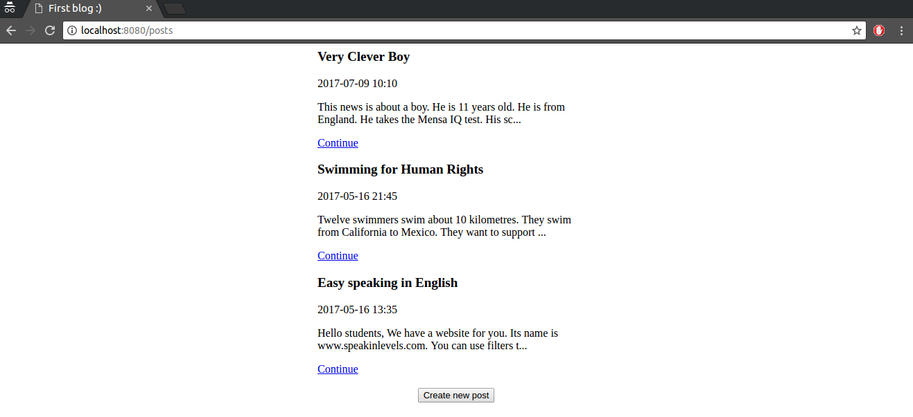
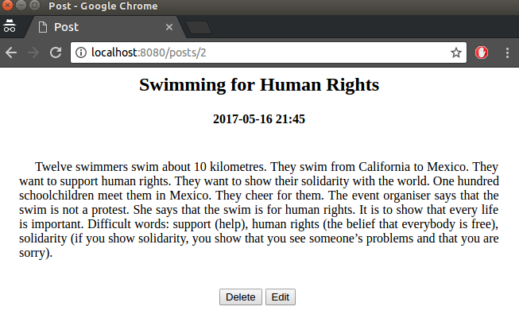
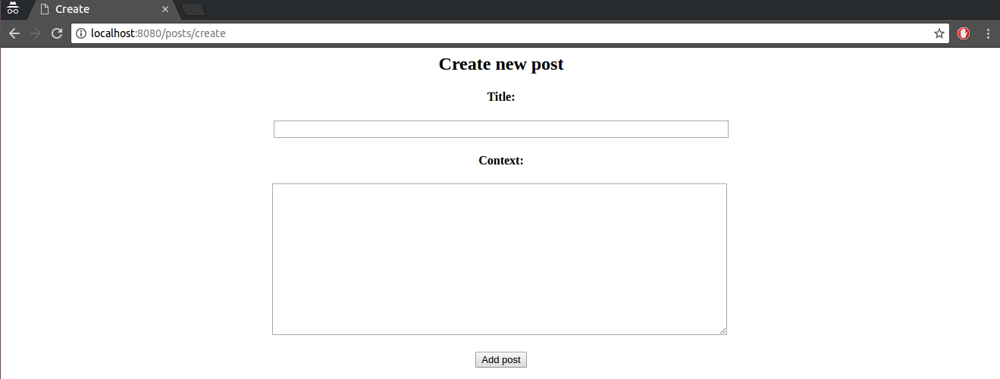
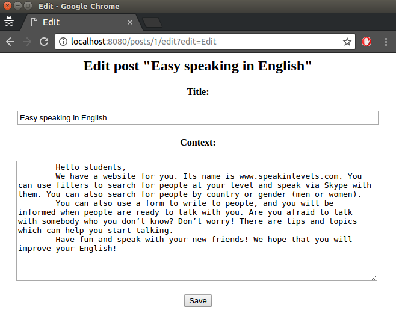

Blog 
=================

## Web application that allows to write articles in blog.

The application is based on Servlets, JSP, JDBC, HTML + CSS and LOG4J as a logging system.
The code is covered with unit tests using JUnit and Mockito.

## Environment Setup

The application requires:

- JDK 1.8 or above;
- Maven 3.3.9 or above;
- Docker 17.05.0.

## How to run

For running ``docker`` command in UNIX / Linux operating system you may need ``sudo``.

Perform the next commands from the root folder of the project step by step:

1. Build docker image for database 
    
    ```
    docker build -t blog:blog-db -f Dockerfile.db .
    ```

2. Run the database 

    ```
    docker run -p 5432:5432 -e POSTGRES_USER=blog -e POSTGRES_PASSWORD=blog -e POSTGRES_DB=blog --name blog_db blog:blog-db
    ```
    
    The following commands must be performed in separate terminal session.

3. Build war-archive with the application 

    ```
    mvn clean package
    ```

4. Build web-server image

    ```
    docker build -t blog:blog-web -f Dockerfile.web .
    ```

5. Run the web server with the application 

    ```
    docker run -it --rm -p 8080:8080 --name blog_web --link blog_db  blog:blog-web
    ```

## Interface

Main page of the application



Post page



Create a new post



Edit page


