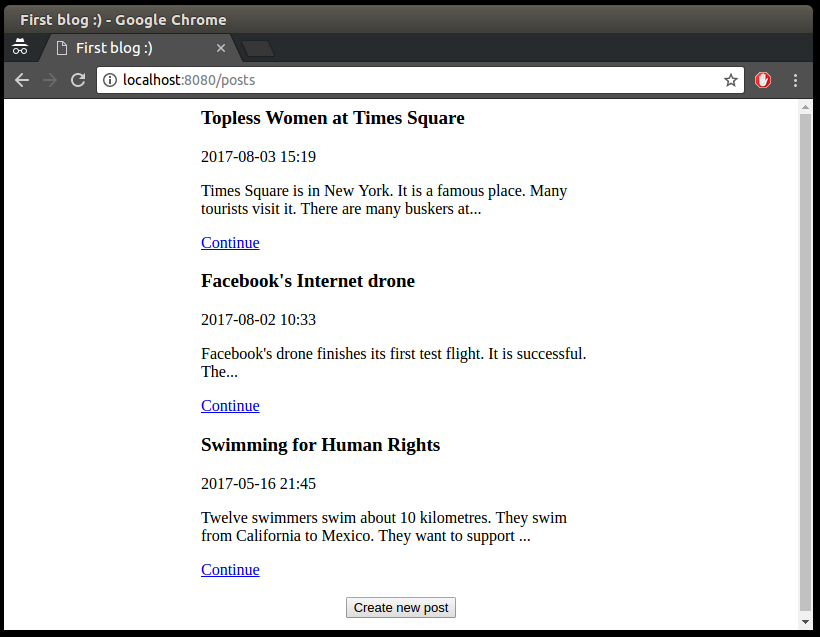

# Blog 
***

##Веб-додаток для додавання, видалення та редагування статей

Додаток базується на JDBC, Servlets та LOG4J як система логування.

## Cистемні вимоги

Для збірки і запуску проекту необхідно JDK 8, Maven та Docker.

## Збірка і запуск проекту

Для ОС UNIX/Linux в усіх командах, які починаються з ``docker``, необхідно написати ``sudo``.

- Зібрати docker image для бази даних 

```
docker build -t blog:blog-db -f Dockerfile.db .
```

- Запустити базу даних 

```
docker run -p 5432:5432 -e POSTGRES_USER=blog -e POSTGRES_PASSWORD=blog -e POSTGRES_DB=blog --name blog_db blog:blog-db
```

- Зібрати war-архів проекту 

```
mvn clean package
```

- Зібрати docker image для сервера 

```
docker build -t blog:blog-web -f Dockerfile.web .
```

- Запустити сервер 

```
docker run -it --rm -p 8080:8080 --name blog_web --link blog_db  blog:blog-web
```

## Інтерфейс

Головна сторінка додатку виглядає наступним чином



Сторінка відображення посту


створення нового посту


і редагування

