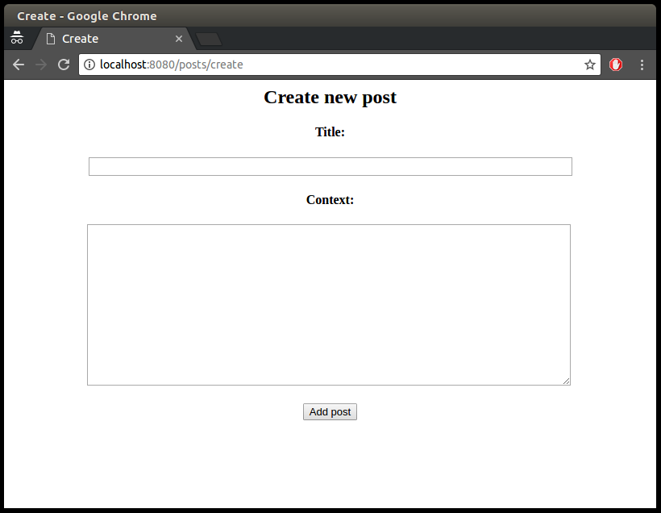
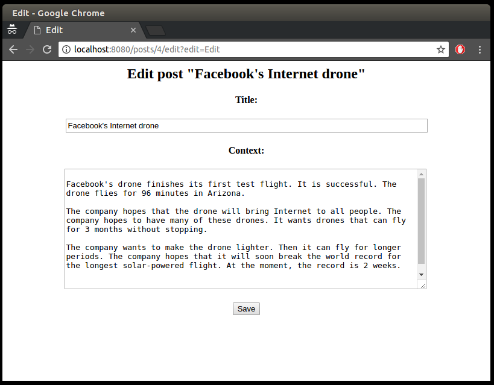

Blog 
=================

##This is a web application for adding, deleting, and editing posts

The application is based on Servlets, JSP, JDBC, HTML + CSS and LOG4J as a logging system.

## Environment Setup

The application requires:

- JDK 1.8 or above;
- Maven 3.3.9 or above;
- Docker 17.05.0.

## How to run

To run commands ``docker`` in the UNIX / Linux operating system you may need to ``sudo``.

Perform the next commands from the root folder of the project step by step:

1. Assemble docker image for database 
    
    ```
    docker build -t blog:blog-db -f Dockerfile.db .
    ```

2. Run the database 

    ```
    docker run -p 5432:5432 -e POSTGRES_USER=blog -e POSTGRES_PASSWORD=blog -e POSTGRES_DB=blog --name blog_db blog:blog-db
    ```
    
    The following commands must be run in a separate session of the terminal.

3. Collect the war-archive of the project 

    ```
    mvn clean package
    ```

4. Collect docker image for web server

    ```
    docker build -t blog:blog-web -f Dockerfile.web .
    ```

5. Run the web server with the application 

    ```
    docker run -it --rm -p 8080:8080 --name blog_web --link blog_db  blog:blog-web
    ```

## The interface

The main page of the application is as follows


The post display page


create a new post



and editing

