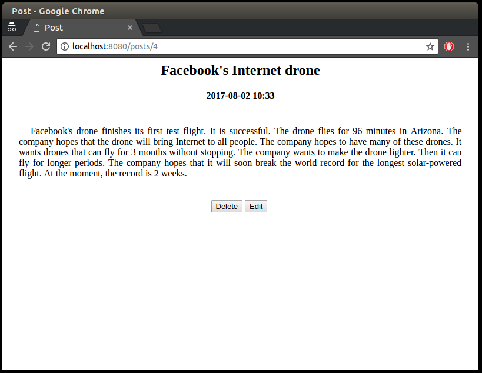

# Blog 
***

##Веб-додаток для додавання, видалення та редагування статей

Додаток базується на Servlets, JSP, JDBC, HTML + CSS та LOG4J як система логування.

## Cистемні вимоги

Для збірки і запуску проекту необхідно:

- JDK 1.8 або вище;
- Maven 3.3.9 або вище;
- Docker 17.05.0 або вище.

## Збірка і запуск проекту

Для запуску команд ``docker`` в ОС UNIX/Linux вам може знадобитись ``sudo``.

1. Зібрати docker image для бази даних 
    
    ```
    docker build -t blog:blog-db -f Dockerfile.db .
    ```

2. Запустити базу даних 

    ```
    docker run -p 5432:5432 -e POSTGRES_USER=blog -e POSTGRES_PASSWORD=blog -e POSTGRES_DB=blog --name blog_db blog:blog-db
    ```
    
    Наступні команди необхідно запустити в окремій сесії терміналу.

3. Зібрати war-архів проекту 

    ```
    mvn clean package
    ```

4. Зібрати docker image для веб сервера 

    ```
    docker build -t blog:blog-web -f Dockerfile.web .
    ```

5. Запустити веб сервер з додатком 

    ```
    docker run -it --rm -p 8080:8080 --name blog_web --link blog_db  blog:blog-web
    ```

## Інтерфейс

Головна сторінка додатку виглядає наступним чином


Сторінка відображення посту



створення нового посту


і редагування

